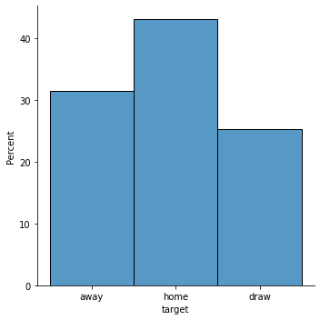

Purpose of the project
==================

The goal is to predict the outcome of matches: the probability of a home win, a draw and an away win.  

Source
==================
The data comes from the kaggle competition:

[football-match-probability-prediction/data](https://www.kaggle.com/competitions/football-match-probability-prediction/data)

Data description
===================

The dataset contains more than 150000 historical soccer matches around the world from 2019-2021, with more than 860 leagues and 9500 teams described on 386 attribute.


The data is divided into a training set with a value for who won the match and a test set with no information about the match won. The kaggle platform, based on the inserted predicted results for the test set, calculates the error.


Example features
===================

The data contains information about the current, match, such as two team names, who is the host, id of the coaches, id of the league, whether it is a cup match. Also have information, about the results of the team of the last 10 matches (but without information about who they played against), just what the result was, and the rankings of these teams, with the dates of the matches played.


Features added by me
===================

* Average team ranking, based on 4 games back to back.
* Average team ranking, based on the entire dataset.
* Intensity of teams, how much time has passed since the last game.
* Average ranking of teams in the league.
* Historically, who won the match on the basis of goals.
* Goal difference in historical matches.
* Whether there has been a change of coach.
* Number of wins in 4 back to back matches.

Data cleanup
===================

More than 42\% of the data, contained rows, with empty values.
Therefore, I first truncated the data to columns containing 4 historical matches. Later, I removed objects that have more than 50\% of empty data, then removed objects with missing values for time columns, and replaced the rest of the missing data with zeros. In this way, I removed only 10\% of the data. 

Distribution of probability of winning the match
===================




Tested classical models
===================

I tested models such as svm, random forests with the use of cross-validation for parameter selection. However, all of these models performed worse than simple logistic regression, which scored a little less than 50 percent accuracy.  


Feature selection
===================

Using, greedy forward feature selection, it came out that only the team ranking improves the prediction, the rest of the attributes do not matter, so in further analysis I did not exclude any feature.


Final model
===================

In the end, I used a simple neural network, which achieved minimally better results than logistic regression. The selection of the parameters of the neural network, I made on the basis of 5 measurements of differently divided training and validation set (StratifiedKFold applications). I saved the learning result for the 5 samples to a file along with the calculated median error. Also to evaluate the learning, I used a tensorboard that drew a graph of error and relevance for the tested models. In addition to the model parameter, I tested whether min max normalization performed better than standardization, and for how many historical backward matches the models perform best.

```
model = tf.keras.Sequential([
  tf.keras.layers.Dense(
      16, activation='relu',
      input_shape=shape),
  tf.keras.layers.Dropout(0.3),
  tf.keras.layers.Dense(3)
 ])

model.compile(optimizer=tf.keras.optimizers.Adam(0.001),
          loss=tf.keras.losses.SparseCategoricalCrossentropy(from_logits=True),
          metrics=['accuracy'])
```


Operation of the prediction model
===================

* Load training and testing data.
* Removal of columns that refer to 5 and more historical matches.
* Correcting the type of data and cleaning it, completing it.
* Adding new features.
* Normalizing min max data based on training data.
* Teaching the neural network model.
* Adding softmax activation function to the neural network and making prediction.
* Re-loading the data, only that 1 back match history. 
* For the test data do not have a history of 4 matches, I will make a prediction by logical regression.
* For the remaining test data that did not even have a history of 1 match, save the result of home:42%,draw:27%,away:31%.
* Saving the prediction result and inserting into kaggle. 

Kaggle scores
===================

I only reached 224th place with a score of 1.03189, where the buchmakers score was 0.97884. 

However, a naive model that is based only on the probability distribution home:42%, draw:27%, away:31%.

It got a score, with a kaggle equal to 1.07.

Conclusions
===================

 * This is a highly randomized problem.
 * Of the features I added, only the total team ranking turned out to be significant.
 * A further step, could be to check the prediction based not on the whole set but on the teams belonging to the same leagues. 
